import { Aside, Steps } from "@astrojs/starlight/components";

The `./provision.sh` script bootstraps everything you need for a running Platform Agent on GKE: cluster, CRDs, IAM, secrets, Chat integration, inference gateway, and the token minter.

<Aside type="note">
  Prerequisites: a GCP project with billing enabled and `gcloud` authenticated.
  If you're starting from a fresh project, the provisioner creates the cluster
  for you. You do **not** need to install
  [cert-manager](/kube-agents/install/prerequisites/#cert-manager-on-the-target-cluster)
  by hand — step 03 installs it when it isn't already present.
</Aside>

## Run the provisioner

<Steps>

1. **Clone the repo.**

   ```bash
   git clone https://github.com/gke-labs/kube-agents.git
   cd kube-agents
   ```

2. **Run the provisioner.**

   ```bash
   make gcp-provision
   ```

   Or run the master script directly:

   ```bash
   cd k8s-operator/scripts
   ./provision.sh
   ```

   The first run is interactive: it prompts for the values it needs (project ID, region, cluster name, model provider, API key, GitOps repo). Answers are cached in `k8s-operator/scripts/vars.sh` (git-ignored) so re-runs are non-interactive.

3. **Configure Google Chat** in the [Chat API console](https://console.cloud.google.com/apis/api/chat.googleapis.com) to publish events to the Pub/Sub topic created in step 05. The provisioner prints the topic name when it finishes.

4. **Verify.**

   ```bash
   kubectl get agents -A
   kubectl get pods -n kubeagents-system
   ```

   With the default settings you should see three `Agent` resources — one per tier — and pods for the operator, the agents, LiteLLM, and Minty. When the platform agent pod is `Running`, DM your Chat app and it should reply.

</Steps>

## What just happened

`./provision.sh` runs a sequence of modular sub-scripts. Each is idempotent, so re-running the master script skips work already done.

```mermaid
flowchart TB
    A[provision.sh] --> B["01: GKE cluster<br/>Workload Identity"]
    A --> C["02: gVisor node pool (opt-in)"]
    A --> D["03: cert-manager + operator CRDs + manager"]
    A --> E["04: IAM + Workload Identity bindings"]
    A --> F["05: Google Chat Pub/Sub"]
    A --> G["06: Slack (opt-in)"]
    A --> H["07: LLM API key Secret"]
    A --> I["08: platform-tier Agent CR"]
    A --> J["09: LiteLLM Deployment"]
    A --> K["10: Minty + GCP KMS"]
    A --> L["11: inference-replay (opt-in)"]
    A --> M["12: cluster-admin + developer-team Agent CRs"]
    A --> N["13: egress allowlist + tenant default-deny"]
```



See [Provisioning scripts](/kube-agents/operator/provisioning-scripts/) for the per-script breakdown.

## Common flags and toggles

- `--dry-run` — prints what would be done without applying anything.
- `ENABLE_GVISOR=true` — provisions the gVisor sandbox node pool in step 02.
- `SLACK_ENABLED=true` — configures Slack tokens in step 06 (otherwise step 06 no-ops). `SLACK_ALLOWED_USERS` is required when it is on: an empty allowlist is rejected by admission.
- `INFERENCE_REPLAY_ENABLED=true` — deploys the inference-replay proxy in step 11.
- `CLUSTER_ADMIN_ENABLED=false` — skip the cluster-admin tier in step 12 (this also skips the developer-team tier, which needs it as a parent).
- `EGRESS_POLICIES_ENABLED=false` — skip step 13. Leave it on: those policies are the containment story.

Set these as environment variables before running, or accept the interactive defaults.

## Uninstall

`./teardown.sh` runs the sub-scripts in reverse order. See [Uninstall](/kube-agents/install/uninstall/) for the full procedure.

## Next steps

- [Concepts → Platform Agent](/kube-agents/concepts/platform-agent/) — what the agent's persona is doing and why.
- [Concepts → ChatOps](/kube-agents/concepts/chatops/) — how humans talk to it, and how proactive alerts come back.
- [Skill catalog](/kube-agents/skills/) — everything the agent can do out of the box.
