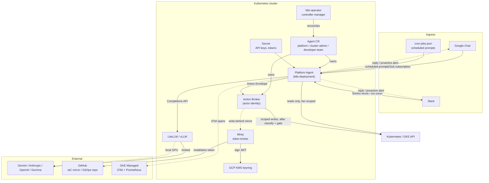

import { Aside } from "@astrojs/starlight/components";

Ingress paths converge on the Platform Agent pod: user chat, scheduled cron, and the operator itself.

## Component map

## The request flows

### 1. Chat request → reply

<Aside type="note">
  Google Chat is fully wired and end-to-end tested. Slack is opt-in via
  `SLACK_ENABLED=true` during provisioning; see
  [ChatOps](/kube-agents/concepts/chatops/).
</Aside>

1. A user posts in a Google Chat space (or DMs the Slack app).
2. Google Chat publishes the event to a Pub/Sub topic; Slack routes via Socket Mode. `provision_05_gcp_gchat.sh` sets up the topic and subscription.
3. The Platform Agent pod consumes the event via its `platform_control` MCP server.
4. Hermes runs a tool-calling loop: system prompt (`SOUL.md`) + user message + available tools. It picks skills to load and MCP tools to call.
5. Cluster reads go through the in-pod `platform_control` MCP server under the pod's read-only ServiceAccount; anything that changes state leaves the pod as an Action Envelope (see flow 3) rather than as a `kubectl` or `gcloud` call.
6. The reply is posted back to the same Chat thread. Long operations return a summary; console links use the templates in `SOUL.md §6`.

### 2. Cron tick → autonomous run

1. The Hermes runtime evaluates `agents/platform/cron/jobs.json` on schedule.
2. Each firing sends the pre-authored `prompt` (usually "read `/opt/defaults/governance/<sop>.md` and execute") to the Platform Agent as a synthetic message.
3. The agent reads the SOP, executes the diagnostic queries, produces findings.
4. If the SOP says "remediate", flow 3 runs; if it says "notify", the agent posts to the configured Chat channel.

### 3. Remediation → executed change

1. The agent invokes `apply-change` with an **Action Envelope** — an `intent` written for a human, the concrete `operations`, and the `trigger_source` that put it in motion (here, `cron`). `plan_action` returns the classification and undo plan without changing anything; `submit_action` is the same envelope, executed.
2. The **Action Broker** authenticates the caller, derives `(tier, scope)` from that authenticated identity rather than from the envelope, and resolves every target against it.
3. It classifies the risk in code, checks the brake, generates an undo plan, and gates if required. A gated action **parks** — nothing changes until a human on the approval roster approves.
4. It snapshots, executes, verifies, and journals an `ActionRecord` with an undo handle.
5. The agent reports what happened: the `actionId` and undo handle, or that the action is parked and with whom, or the refusal verbatim.
6. Where a write-behind IaC mirror is configured, the broker commits the resulting state to the GitOps repo afterwards, using a Minty-minted token. That is a record, not an approval step.

## Deployment topology

Everything except the LLM (and, for hosted providers, the LLM API endpoint) runs inside your Kubernetes cluster:

- **Namespace**: `kubeagents-system` (renamed from earlier `platform-agent-system` in PR #336).
- **Node pools**: default node pool is enough for the operator, Platform Agent, LiteLLM, and Minty. If you use vLLM, provision a GPU node pool separately.
- **Optional gVisor node pool** for sandboxed skill execution (`provision_02_gvisor_nodepool.sh`, opt-in via `ENABLE_GVISOR=true`).
- **Workload Identity** bindings are pre-provisioned in `provision_04_gcp_iam.sh` — the operator gets cluster management scope, the Platform Agent gets a configurable permission set (`read-only`, `gke-admin`, or `custom`).

## Failure modes worth knowing

- **LLM outage.** LiteLLM proxies retries and can fall back to a secondary provider if configured. `SOUL.md §8` retries via the recovery ladder; the agent will report the failure in Chat rather than hang.
- **Cron overlap.** Long-running watchdogs (e.g. `security-patch-orchestrator`) can overlap with hourly jobs. Hermes serializes messages per session; overlap manifests as queueing, not concurrency.
- **Minty token exhaustion.** GitHub App installation tokens are 1-hour scoped. Minty caches and re-mints as needed; if the token refresher fails, the GitHub-side flows (IaC mirror, rendered provisioning bundles, `github-issue-resolver`) surface it and route through the recovery ladder. The change path itself does not depend on Minty.
- **Pub/Sub subscription drift.** If the GChat Pub/Sub subscription is deleted out of band, no chat messages arrive and no error surfaces automatically. Cron-driven runs still work, and the `kube-agents-observability` skill helps triage.

## Where to go next

- [Platform Agent](/kube-agents/concepts/platform-agent/) — the persona, safety rails, and MCP wiring.
- [ChatOps](/kube-agents/concepts/chatops/) — Google Chat and Slack ingress details.
- [Declarative workflow](/kube-agents/concepts/declarative-workflow/) — the envelope, the broker pipeline, and where Git still fits.
